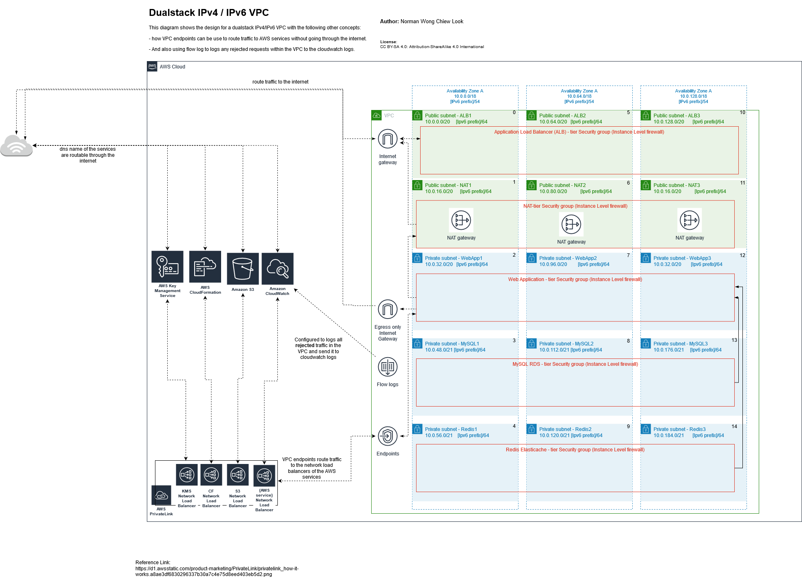
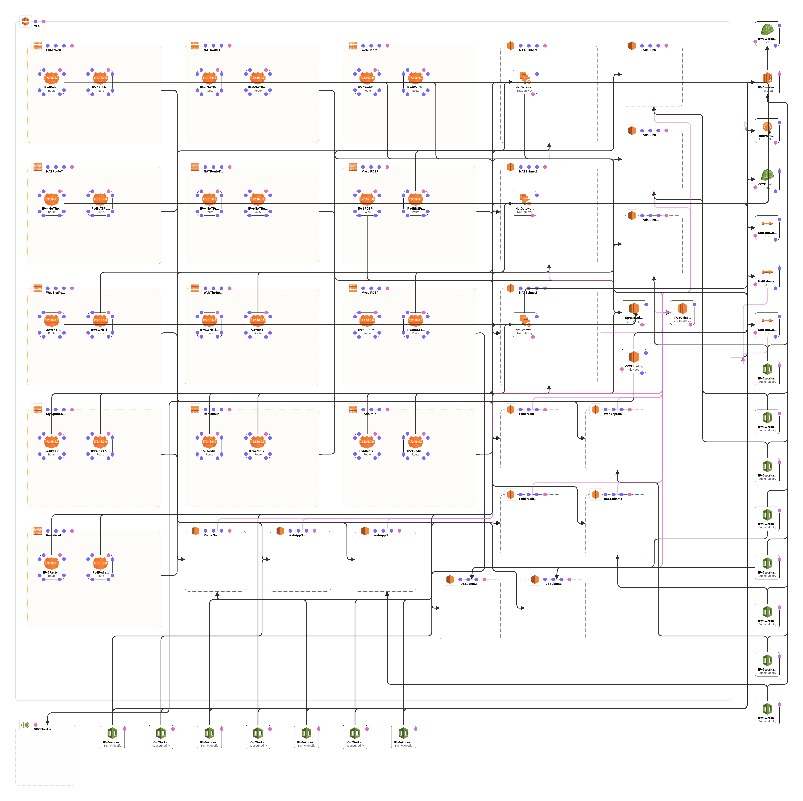

# Dualstack IPv4/IPv6 VPC network (Work in progress)

This repository provides a set of YAML templates to create a dualstack IPv4 and IPv6 VPC in AWS.

## Overview

### Categories

- [VPC](#vpc)
- [Security Groups](#security-groups)
- [NACL](#nacl)
- [Endpoints](#endpoints)

## Templates

[Back to Top](#overview)

### VPC

[Back to Top](#overview)

<table width="100%">
    <tr>
        <th align="left" colspan="2"><h4><a href="https://github.com/klezca/aws-infrastructure-2/blob/master/templates/vpc/vpc.yaml">VPC</a></h4></th>
    </tr>
    <tr>
        <td width="100%" valign="top">
            
Select the foundational pieces for building out a dualstack IPv4/IPv6 VPC network from the ground up.

            <h6>Create Details</h6>
            <ol>
                <li>VPC</li>
                <li>VPC Flow Log</li>
                <li>IPv6 Cidr Block</li>
                <li>Internet Gateway</li>
                <li>Egress Internet Gateway</li>
                <li>3 NAT Gateways</li>
                <li>3 Public Subnets</li>
                <li>3 Public-NAT tier Subnets</li>
                <li>3 Private Web-app tier Subnets</li>
                <li>3 Private MySQL-RDS tier Subnets</li>
                <li>3 Private Redis-Elasticache tier Subnets</li>
                <li>Route Tables</li>
                <li>IPv6 workaround IAM role and Lambda with python runtime</li> 
            </ol>
        </td>
        <td  nowrap width="200" valign="top">
            <table>
                <tr>
                    <th align="left">View Diagram</th>
                </tr>
                <tr>
                    <td>
                        
                    </td>
                </tr>
            </table>
        </td>
    </tr>
</table>

# Work in Progress
